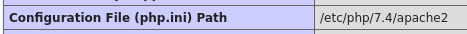
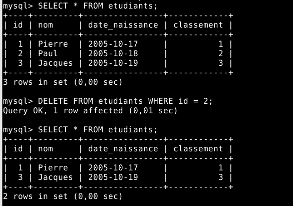

# Compte rendu SAE 2.03

## CHEF DE PROJET : NEVOT Pierre

## MEMBRES DE L'EQUIPE :

- NEVOT Pierre
- LE VERGE Lou
- CHAPLAIS Ethan
- GOGDET Maël

# Partie TP : Installation d'un service réseau

Après avoir copié les fichiers de la SAE 2.03 dans notre disque Z:. On peut lancer la machine virtuelle et se connecter avec les logins : root | lannion.


## Prise en main et le service wen avec Apache2

### 1. Prenez connaissance de votre environnement pratique (VM de la SAÉ).

J'obtiens l'ip locale de la machine avec la commande `ip a` et je peux voir que l'ip est `127.0.0.1/8` et que l'ipV6 est `::1/128`.


### 2. Vérifiez le statut d’exécution du service Web (assuré par le paquage apache2) avec la commande : # systemctl status apache2.

J'éxécute la commande `systemctl status apache2` et je peux voir que le service est actif et qu'il s'éxécute continuellement.


#### 2.b Relevez les informations pertinentes qui montre qu’il s’exécute continuellement (ce qui est normal car c’est un serveur).

Le principe d'un service est de s'éxécuter continuellement, on peut voir que le service est actif et qu'il est en cours d'éxécution.

#### 2.c Relevez à quelle heure exacte, le serveur a été lancé la toute dernière fois.

Le server a été lancé pour la dernière fois le 22 mai à 8h44min11s. On peut en déduire qu'il a été lancé en même temps que la machine virtuelle. On peut le voir sur la capture d'écran à la ligne :

"mai 22 08:44:11 SAE systemd[1]: Starting The Apache HTTP Server..."

### 3. Dans quel fichier de configuration de votre serveur Web, se trouve la directive « DocumentRoot » ? Quelle est sa valeur ? Rappelez l’utilité de cette directive?

La directive `DocumentRoot` se trouve dans le fichier de configuration `/etc/apache2/sites-available/000-default.conf`. Sa valeur est `/var/www/html`. Cette directive permet de définir le répertoire racine du serveur web. C'est à dire que c'est le répertoire où le serveur web va chercher les fichiers à envoyer au client. On peut voir entourer en rouge la directive `DocumentRoot` et sa valeur `/var/www/html` sur la capture d'écran ci-dessous. Et aussi le répertoire ou se situe la configuration du serveur web.


Source : [https://httpd.apache.org/docs/2.4/fr/mod/core.html#documentroot](https://httpd.apache.org/docs/2.4/fr/mod/core.html#documentroot)

### 4. Repérez le chemin du binaire (exécutable) du service Web (apache2) en utilisant la commande « type » et l’option « a »

J'éxécute la commande `type -a apache2` et je peux voir que le binaire se trouve dans `/usr/sbin/apache2` et `/sbin/apache2`. On peut le voir sur la capture d'écran ci-dessous.


### 5. Identifier la version exacte du serveur Apache. Pourquoi il est important de connaitre la version exacte ?

Pour identifier la version du serveur Apache, on peut utiliser la commande `apache2 -v`. On obtient : `Server version: Apache/2.4.53 (Debian) Server built:   2022-03-14T16:28:35`. La version exacte est `2.4.53 (Debian)`. Il est important de connaitre la version exacte du serveur Apache pour des raisons de sécurité. En effet, si on connait la version exacte, on peut savoir si le serveur est à jour et si il est vulnérable à des failles de sécurité.

Source : commande `man apache2`

### 6. Listez les modules installés nativement (compilé dans le noyau) du le serveur avec la commande « apache2 » et l’argument de commande « l »

Pour lister les modules installés nativement, on peut utiliser la commande `apache2 -l`.  On obtient :

> Compiled in modules:
> core.c
> mod_so.c
> mod_watchdog.c
> http_core.c
> mod_log_config.c
> mod_logio.c
> mod_version.c
> mod_unixd.c

### 7. D’après vous, quel est le rôle du module « mod_log_config.c » ?

Le module `mod_log_config.c` permet de configurer les logs du serveur web. Il permet de définir le format des logs, les informations à logger, le fichier de log, etc. C'est un module très important pour la sécurité et le débuggage du serveur web.

Source : [https://httpd.apache.org/docs/2.4/fr/mod/mod_log_config.html](https://httpd.apache.org/docs/2.4/fr/mod/mod_log_config.html)

### 8. La commande précédente ne liste pas tous les modules chargés dynamiquement par le serveur Web (comme par exemple ceux chargés avec la directive nommée « LoadModule »). Pour lister tous les modules (statique et dynamie), utilisez la commande : apache2 -M et relevez les modules affichés

Pour lister tous les modules (statique et dynamique), on peut utiliser la commande `apache2 -M`. On peut voir que j'obtiens une erreur `AH00111: Config variable ${APACHE_RUN_DIR} is not defined apache2: Syntax error on line 80 of /etc/apache2/apache2.conf: DefaultRuntimeDir must be a valid directory, absolute or relative to ServerRoot`.
Qui veut dire que le répertoire par défaut n'est pas défini.


On peut avoir après que j'éxécute la commande `apachectl -M` et là j'obtiens la liste des modules chargés de manière statique et dynamique :

> Loaded Modules:
> core_module (static)
> so_module (static)
> watchdog_module (static)
> http_module (static)
> log_config_module (static)
> logio_module (static)
> version_module (static)
> unixd_module (static)
> access_compat_module (shared)
> alias_module (shared)
> auth_basic_module (shared)
> authn_core_module (shared)
> authn_file_module (shared)
> authz_core_module (shared)
> authz_host_module (shared)
> authz_user_module (shared)
> autoindex_module (shared)
> deflate_module (shared)
> dir_module (shared)
> env_module (shared)
> filter_module (shared)
> mime_module (shared)
> mpm_prefork_module (shared)
> negotiation_module (shared)
> php7_module (shared)
> reqtimeout_module (shared)
> setenvif_module (shared)
> status_module (shared)

### 9. Notez la différence entre les commandes « apache2 -version » et « apache2 -v ». « apache2 -v » ne donne pas d’erreur mais « apache2 -version » peut le faire. S’il y a un message d’erreur, il faut le corriger.

Je n'ai aucun message d'erreur avec la commande `apache2 -v` et `apache2 -version`. On peut voir que j'obtiens la version du serveur Apache avec les deux commandes.


#### 9.a En fait le message d’erreur, s’il y en a, ce n’est pas une erreur grave mais c’est ce qu’on appelle « un avertissement amical » (en anglais « friendly warning ») et la réponse est dans le message d’erreur

Je n'ai obtenu aucun message d'erreur avec les commandes `apache2 -v` et `apache2 -version`.
J'ai quand même ajouté `ServerName localhost` dans le fichier `/etc/apache2/apache2.conf` pour éviter d'avoir des erreurs. Pour bien appliquer la configuration, j'ai redémarré le serveur avec la commande `systemctl restart apache2`.


### 10. Création d’une partie administration (« privée ») du serveur Web accessible uniquement par login/mot de passe géré directement par le serveur Web (et non pas par une base de donnée):

#### 10.a Créer un dossier « private » dans la racine du serveur web (/var/www/html/)

Je crée un dossier `private` dans la racine du serveur web avec la commande `mkdir /var/www/html/private`. Et j'y accède avec la commande `cd /var/www/html/private`.


#### o Créer dedans un fichier index.html. Personnaliser le contenu et le titre de cette page

Je crée un fichier `index.html` dans le dossier `private` avec la commande `touch index.html`. Et j'édite le fichier avec la commande `nano index.html`.

J'ajoute le code suivant :

```html
<!DOCTYPE html>
<html lang="fr">
<head>
    <meta charset="UTF-8">
    <meta http-equiv="X-UA-Compatible" content="IE=edge">
    <meta name="viewport" content="width=device-width, initial-scale=1.0">
    <title>Administration</title>
</head>
<body>
    <h1>Page privée</h1>
    <p>Cette page est privée</p>
    <a href="/">Retour à l'accueil</a>
</body>
</html>
```

Page html simple pour l'accueil :

```html
<!DOCTYPE html>
<html lang="fr">
<head>
    <meta charset="UTF-8">
    <meta http-equiv="X-UA-Compatible" content="IE=edge">
    <meta name="viewport" content="width=device-width, initial-scale=1.0">
    <title>Accueil</title>
</head>
<body>
    <h1>Page d'accueil</h1>
    <p>Bienvenue sur la page d'accueil</p>
    <a href="/private">Administration</a>
</body>
</html>
```

#### 10.b Depuis la page d’accueil du serveur, créer un lien qui permet d’accéder à l’espace privé (`<a href="/private">`administration`</a>`) et vice-versa.**

Je crée un lien qui permet d'accéder à l'espace privé depuis la page d'accueil du serveur. Pour cela, j'édite le fichier `index.html` dans la racine du serveur web avec la commande `nano /var/www/html/index.html`.

#### 10.c Inspirez-vous du text TD pour n’autoriser l’accès au dossier « privé » qu’après  authentification à l’utilisateur de login « admin »et de mot de passe « lannion ».

D'abord je met en place pour un mot de passe pour un utilisateur `admin` avec le mot de passe `lannion`. Pour cela, j'utilise la commande : `htpasswd -c /etc/apache2/pass admin`. On me demande de saisir le mot de passe et de le confirmer. Ensuite, je redémarre le serveur avec la commande `systemctl restart apache2`.


Ensuite, je configure le fichier de configuration du serveur web pour autoriser l'accès au dossier `private` qu'après authentification de l'utilisateur `admin` avec le mot de passe `lannion`. Pour cela, j'édite le fichier de configuration `/etc/apache2/sites-available/000-default.conf` avec la commande `nano /etc/apache2/sites-available/000-default.conf`. J'ajoute les lignes suivantes :

```apache
<Directory "/var/www/html/private">
    AuthType Basic
    AuthName "Veuillez saisor votre mot de login/passe"
    AuthUserFile /etc/apache2/pass
    Require valid-user
</Directory>
```


Je redémarre le serveur avec la commande `systemctl restart apache2`.

Maintant quand je clique sur le lien `Administration` depuis la page d'accueil, on me demande de saisir un login et un mot de passe. Je saisis `admin` et `lannion` et je peux accéder à la page privée.


Puis je peux accéder à la page privée.


## Le module PHP

La façon la plus simple de vérifier la configuration PHP, y compris pour voir les modules
associées qui sont installés, est de créer un script php de test en utilisant la fonction php :
phpinfo().
§ Repérer le dossier des pages Web de votre serveur Apache

### 1. Créez dedans un dossier secret et créer dedans un fichier texte nommé : phpinfo.php et incluant le code suivant : <?php phpinfo(); ?

Je crée un dossier `secret` dans la racine du serveur web avec la commande `mkdir /var/www/html/.secret`. Et j'y accède avec la commande `cd /var/www/html/.secret`.

Je crée un fichier `phpinfo.php` dans le dossier `secret` avec la commande `touch phpinfo.php`. Et j'édite le fichier avec la commande `nano phpinfo.php`.

Je rajoute le code suivant :

```php
<?php
phpinfo();
?>
```


### 2. Pourquoi est il recommandé de créer un dossier secret ?

Il est recommandé de créer un dossier `secret` pour stocker les fichiers sensibles ou confidentiels. Cela permet de les protéger et de les cacher des utilisateurs non autorisés. Ou encore pour les protéger des robots qui scannent les sites web à la recherche de failles de sécurité.

### 3. Quelle est l’URL pour accéder à votre fichier php depuis un navigateur Web ?

Pour accéder au fichier `phpinfo.php` depuis un navigateur web, on peut utiliser l'url `http://localhost/.secret/phpinfo.php` ou en remplacant `localhost` par l'ip de la machine virtuelle qui est local `127.0.0.1`. On peut préciser le port 80 pour le serveur web.

### 4. Accédez à cette URL. Peut-on confirmer après cet accès que le module PHP est activé par le serveur ?

Je peux confirmer que le module PHP est activé par le serveur. On peut voir que le fichier `phpinfo.php` s'éxécute correctement et qu'il affiche les informations de configuration de PHP. On peut voir que le module PHP est activé par le serveur.


### 5. Confirmez que le module PHP est bien activé par le serveur Web en vérifiant : (1) le contenu d’un dossier propre à Apache et (2) le contenu d’un fichier X (X est à préciser, indication : voir TD). (3) Vérifiez avec la commande « ls -l » appliqué à ce fichier X : que le fichier X n’est pas un fichier « classique »

#### 5.a Vérifiez que PHP est bien activé par le contenu d'un dossier propre à Apache

Pour vérifier que le module PHP est activé par le serveur web, on peut vérifier le contenu du dossier `/etc/apache2/mods-enabled/`. On peut voir que le module `php7.load` est présent dans le dossier. On peut voir que le module PHP est activé par le serveur web.

Ici le module php7.4.load est activé. car il se trouve dans mods-enabled.


#### 5.b Vérifiez que PHP est bien activé par le contenu d'un fichier X

Pour vérifier que le module PHP est activé par le serveur web, on peut vérifier le contenu du fichier `/etc/apache2/mods-enabled/php7.4.load`. On peut voir que le fichier est un lien symbolique vers le fichier `/etc/apache2/mods-available/php7.4.load`. On peut voir que le module PHP est activé par le serveur web.

En faisant nano sur le fichier php7.4.load on peut voir que c'est un lien symbolique.
`LoadModule php7_module /usr/lib/apache2/modules/libphp7.4.so`


#### 5.c Vérifiez avec la commande « ls -l » appliqué à ce fichier X : que le fichier X n’est pas un fichier « classique »

Pour vérifier que le fichier `php7.4.load` n'est pas un fichier classique, on peut utiliser la commande `ls -l /etc/apache2/mods-enabled/php7.4.load`. On peut voir que le fichier est un lien symbolique vers le fichier `/etc/apache2/mods-available/php7.4.load`. On peut voir que le fichier n'est pas un fichier classique.

La commande retourne :
`lrwxrwxrwx 1 root root 29  4 mai    2022 /etc/apache2/mods-enabled/php7.4.load -> ../mods-available/php7.4.load`


### 6. Accédez à votre script php : phpinfo.php avec le navigateur et relevez les informations suivantes sur la page affichée par le serveur :

#### 6.i La version exacte du module PHP utilisé par notre serveur Web

La version exacte du module PHP utilisé par notre serveur Web est `7.4.28`.


#### 6.ii Le dossier de configuration du module PHP utilisé par notre serveur Web

Le dossier de configuration du module PHP utilisé par notre serveur Web est `/etc/php/7.4/apache2`.

#### 6.iii Le fichier de configuration de php pour le serveur Web

Le fichier de configuration de PHP pour le serveur Web est `/etc/php/7.4/apache2/php.ini`.


#### 6.b La valeur de l’étiquette appelée « short_open_tag »

La valeur de l'étiquette appelée `short_open_tag` est `Off`.


#### 6.c À votre avis, dans quel fichier de configuration (chemin exacte) peut-on modifier la valeur de cette étiquette « short_open_tag »?

Pour modifier la valeur de l'étiquette `short_open_tag`, on peut modifier le fichier de configuration `/etc/php/7.4/apache2/php.ini`. On peut voir que l'étiquette `short_open_tag` est présente dans le fichier de configuration de PHP.

On peut observer l'option ci-dessous dans le fichier php.ini.


#### 6.d Si on devrait modifier la valeur de cette étiquette dans un fichier de configuration, faut-il recharger/relancer le serveur Web pour que la nouvelle valeur soit prise en compte ?

Si on devrait modifier la valeur de l'étiquette `short_open_tag` dans un fichier de configuration, il faut recharger le serveur web pour que la nouvelle valeur soit prise en compte. Pour recharger le serveur web, on peut utiliser la commande `systemctl reload apache2`.

Source : [https://www.php.net/manual/fr/ini.core.php#ini.short-open-tag](https://www.php.net/manual/fr/ini.core.php#ini.short-open-tag)

### 7. À l’aide de la commande « whereis », trouvez le chemin du binaire (de l’exécutable si vous préférez) du module php

Pour trouver le chemin du binaire du module PHP, on peut utiliser la commande `whereis php`. On peut voir que le binaire se trouve dans `/usr/bin/php7.4` et `/usr/bin/php`.


#### 7.i Confirmez, avec l’option -v du binaire, la version du module php obtenue précédemment

Pour confirmer la version du module PHP obtenue précédemment, on peut utiliser la commande `php -v`. On peut voir que la version du module PHP est `7.4.28`.


### 8. Désactiver le module PHP en ligne de commande

Pour désactiver le module PHP en ligne de commande, on peut utiliser la commande `a2dismod php7.4`. On peut voir que le module PHP est désactivé par le serveur web. On peut voir que le module PHP n'est plus activé par le serveur web.

Source : [https://manpages.ubuntu.com/manpages/trusty/man8/a2enmod.8.html](https://manpages.ubuntu.com/manpages/trusty/man8/a2enmod.8.html)

### 9. Faut-il relancer le serveur Apache pour prendre en charge la désactivation ? Si oui faites-le.

Oui, il faut redémarrer le serveur apache quand on désactive le php. Car on a le message quand on exécute la commande.


root@SAE:~# a2dismod php7.4
Module php7.4 disabled.
To activate the new configuration, you need to run:
  systemctl restart apache2
root@SAE:~#

### 10. Quelle est la conséquence de cette désactivation ? Est-elle dangereuse dans le cas où il subsiste des fichiers PHP sur notre serveur ? Effectuez deux tests : un avec un accès URL et un test de vérification du contenu d’un dossier propre à Apache (à préciser) pour montrer la désactivation du PHP.

La désactivation du module PHP entraîne l'impossibilité pour le serveur Apache d'interpréter et d'exécuter les scripts PHP. Cela peut être dangereux si des fichiers PHP sensibles restent sur le serveur, car le code PHP pourrait être exposé directement au client, révélant ainsi des informations confidentielles.

Test avec accès URL
J'accède à l'URL (`http://localhost/.secret/phpinfo.php`) du fichier phpinfo.php après désactivation de PHP :

La page qui nous est retourné est blanche. Car le script ne peut s'exécuter.

Test de vérification du contenu d’un dossier propre à Apache
On vérifie le contenu du dossier /etc/apache2/mods-enabled/ pour confirmer que le module PHP est désactivé :
`ls -l /etc/apache2/mods-enabled/`

Le fichier php7.4.load n'est plus être présent dans ce dossier. Cela montre que le module PHP n'est plus activé par Apache.

### 11. Réactiver le module PHP en ligne de commande. Mêmes questions que précédemment :

#### 11.a Faut-il redémarrer le serveur ? Si oui faites le

Quand je réactive le module php avec `a2enmod php7.4`, j'obtiens :

root@SAE:~# systemctl restart apache2
root@SAE:~# a2enmod php7.4
Considering dependency mpm_prefork for php7.4:
Considering conflict mpm_event for mpm_prefork:
Considering conflict mpm_worker for mpm_prefork:
Module mpm_prefork already enabled
Considering conflict php5 for php7.4:
Enabling module php7.4.
To activate the new configuration, you need to run:
  systemctl restart apache2
root@SAE:~#

Ici la commande nous dit qu'il faut redémarrer le serveur pour que l'activation du php soit effective.

#### 11.b Effectuez les mêmes deux tests de la question précédente

Test avec accès URL
J'accède à l'URL (`http://localhost/.secret/phpinfo.php`) du fichier phpinfo.php après désactivation de PHP :

Ici j'obtiens la page avec les informations du php que nous retourne le script php : phpinfo.php.

Test de vérification du contenu d’un dossier propre à Apache
On vérifie le contenu du dossier /etc/apache2/mods-enabled/ pour confirmer que le module PHP est activé et présent :
`ls -l /etc/apache2/mods-enabled/`


### 12. Insérer dans le code HTML d’une page nommée « mapage.html » (au début par exemple) un code PHP arbitraire. Par exemple « `<?php echo "coucou, je suis un code php dans une page HTML !" ?>`. La page mapage.html est à créer dans la racine du serveur Web.

Je crée un fichier `mapage.html` dans la racine du serveur web avec la commande `touch /var/www/html/mapage.html`. Et j'édite le fichier avec la commande `nano /var/www/html/mapage.html`. J'ajoute le code PHP arbitraire `<?php echo "coucou, je suis un code php dans une page HTML !" ?>` au début du fichier.

```html
<?php echo "coucou, je suis un code php dans une page HTML !" ?>
<!DOCTYPE html>
<html lang="fr">
<head>
    <meta charset="UTF-8">
    <meta http-equiv="X-UA-Compatible" content="IE=edge">
    <meta name="viewport" content="width=device-width, initial-scale=1.0">
    <title>Ma page</title>
</head>
<body>
    <h1>Ma page</h1>
    <p>Bienvenue sur ma page</p>
</body>
</html>
```

### 13. Faut-il redémarrer le serveur pour accéder à la page mapage.html ?

Non, il n'est pas nécessaire de redémarrer le serveur pour accéder à la page `mapage.html`. On peut accéder à la page directement depuis un navigateur web. Ce n'est pas une configuration du serveur web, c'est juste une page HTML avec du code PHP.

### 14. Essayez d’accéder à votre nouvelle page mapage.html, que constatez-vous ? justifiez votre réponse.

Le code PHP arbitraire `<?php echo "coucou, je suis un code php dans une page HTML !" ?>` n'est pas interprété par le serveur web. On peut voir que le code PHP est présent dans le code source de la page mais commenté :

Pour qu'il soit interprété, il faut que le fichier soit en .php et non en .html.

### 15. En modifiant le fichier de configuration du module PHP, dites à apache d’interprétez les fichiers d’extensions .html et .html comme des fichiers php. Indication : voir le TD. Faites le test nécessaire pour confirmer que l’intérprétation demandée est correcte.

Pour dire à Apache d'interpréter les fichiers d'extensions `.html` et `.html` comme des fichiers PHP, on peut modifier le fichier de configuration du module PHP `/etc/apache2/mods-available/php7.4.conf`. On peut ajouter les lignes suivantes à la fin du fichier :

```apache
<FilesMatch "\.html$">
    SetHandler application/x-httpd-php
</FilesMatch>
```


On redémarre le serveur avec la commande `systemctl restart apache2`.

Le code fonctionne maintenant sur la page `mapage.html` :


### 16. Dupliquer le fichier phpinfo.php pour créer un nouveau fichier de nom « phpinfo » (sans l’extension .php). Essayez d’accéder à ce fichier « phpinfo » avec votre navigateur Web. Que remarquez-vous ?

Je duplique le fichier `phpinfo.php` pour créer un nouveau fichier de nom `phpinfo` (sans l'extension .php) avec la commande `cp phpinfo.php phpinfo`.


Quand j'accède à la page le code php ne s'éxécute pas. Il faut que le fichier soit en .php pour que le code soit interprété.


### 17. En s’inspirant du TD, configurer Apache pour traiter les fichiers sans extension comme du code PHP et confirmer votre configuration par un test.

Pour configurer Apache pour traiter les fichiers sans extension comme du code PHP, on peut ajouter les lignes suivantes dans le fichier de configuration du module PHP `/etc/apache2/mods-available/php7.4.conf` :

```apache
<FilesMatch "^([^\.]+)$">
    SetHandler application/x-httpd-php
</FilesMatch>
```


Quand j'accède à la page `phpinfo` sans l'extension .php, le code PHP s'éxécute correctement.


### 18. Apache maintenant interprète du code PHP dans du code HTML et c’est super ! Cependant, écrire du code avec la syntaxe `<?php echo "coucou, je suis un code php dans une page HTML !" ?>` peut être rendu plus facile avec une syntaxe simplifiée du genre : `<? echo "coucou, je suis un code php dans une page HTML !" ?>` (i.e. sans préciser à chaque fois php).

#### 18.a Dans votre page mapage.html changez la syntaxe du code php de `<?php echo "coucou, je suis un code php dans une page HTML !" ?>` vers `<? echo … ?>`

Je modifie la syntaxe du code PHP dans la page `mapage.html` de `<?php echo "coucou, je suis un code php dans une page HTML !" ?>` vers `<? echo "coucou, je suis un code php dans une page HTML !" ?>`.


#### 18.b Tester votre page depuis un navigateur (attention au cache du navigateur, il faut le vider de temps en temps ou mettez-vous en mode « vie privée stricte » pour éviter le cache pendant les manipulations). Que remarquez-vous ?

Ici je remarque que le code php ne s'éxécute pas. Il apparait dans le code source de la page.


#### 18.c Proposez une solution et testez de nouveau pour confirmer que vous avez réussi à exécuter le code php avec une syntaxe `<? code; ?>` et non pas `<?php code; ?>`. Indication : « short_open_tag » !

Pour exécuter le code PHP avec une syntaxe `<? code; ?>` et non pas `<?php code; ?>`, on peut activer l'étiquette `short_open_tag` dans le fichier de configuration de PHP `/etc/php/7.4/apache2/php.ini`. On peut modifier la valeur de l'étiquette `short_open_tag` à `On`. Puis on redémarre le serveur avec la commande `systemctl restart apache2`.

Je redémarre le serveur.

Et voilà le code php s'éxécute correctement avec la syntaxe `<? echo "coucou, je suis un code php dans une page HTML !" ?>`.

## MySQL & PHP

### 1. Sécurisez le serveur MySQL avec la commande « mysql_secure_installation » (le mot de passe root du serveur MySQL doit rester : lannion)

Je lance la commande `mysql_secure_installation` pour sécuriser le serveur MySQL. Je réponds aux questions posées par le script d'installation :


### 2. Vérifier le statut d’exécution du service MySQL (assuré par le paquage mysql-server). Et relevez les informations pertinentes qui montrent que le serveur MySQL s’exécute continuellement (ce qui est normal car c’est un serveur). Relevez à quelle heure exacte, le serveur a été lancé la toute dernière fois.

Pour vérifier le statut d'exécution du service MySQL, on peut utiliser la commande `systemctl status mysql`. On peut voir que le serveur MySQL s'exécute continuellement. On peut voir que le serveur MySQL a été lancé la dernière fois à `mai 22 16:23:21`.


### 3. Identifier la version du serveur MySQL. Attention, l’argument à utiliser pour la commande mysql est « -V » et non « -v »

Pour identifier la version du serveur MySQL, on peut utiliser la commande `mysql -V`. On peut voir que la version du serveur MySQL est `mysql Ver 8.0.29`.


### 4. Connectez-vous au serveur MySQL avec le login « root » et en utilisant la commande mysql et les bons arguments à trouver avec «mysql --help » si nécessaire. Le mot de passe configuré au préalable lors de l’installation est « lannion ».

Pour se connecter au serveur MySQL avec le login `root`, on
peut utiliser la commande `mysql -u root -p`. On me demande de saisir le mot de passe et je saisis `lannion`. On peut voir que je suis connecté au serveur MySQL.


### 5. Tout en restant connecté au serveur MySQL (en ligne de commande), afficher les bases de données existantes au niveau du serveur MySQL avec la commande (requête SQL) : « SHOW DATABASES ; »

Pour afficher les bases de données existantes au niveau du serveur MySQL, on peut utiliser la commande SQL `SHOW DATABASES;`. On peut voir que la liste des bases de données existantes sur le serveur MySQL est affichée.


### 6. Essayer d’avoir le même résultat (i.e. la liste des bases de données existantes sur le serveur) avec un code PHP que vous créez sur le serveur (inspirez-vous du code de TD en améliorant sa sécurité de préférence). Confirmez le résultat en testant votre script avec un accès Web à votre serveur.

Je crée un script PHP nommé `showdb.php` dans la racine du serveur web avec la commande `touch /var/www/html/showdb.php`. Et j'édite le fichier avec la commande `nano /var/www/html/showdb.php`. J'ajoute le code suivant :

```php
<?php
$ipserver = "localhost";
$nomutilisateur = "root";
$motdepasse = ""

if (isset($_POST["motdepasse"])) {
    $motdepasse = $_POST["motdepasse"];
}

$connexion = new mysqli($ipserver, $nomutilisateur, $motdepasse);

if ($connexion->connect_error) {
    die("Erreur de connexion : " . $connexion->connect_error);
}

$resultat = $connexion->query("SHOW DATABASES;");
if ($resultat->num_rows > 0) {
    while ($ligne = $resultat->fetch_assoc()) {
        echo $ligne["Database"] . "<br>";
    }
} else {
    echo "Aucune base de données trouvée";
}

$connexion->close();
?>
```

Source : [https://www.php.net/manual/fr/mysqli.query.php](https://www.php.net/manual/fr/mysqli.query.php)

#### 6.a Sous certaines conditions, lorsqu’on essaie d’accéder à la liste des bases de données par le script php, le journal d’erreur d’apache (le /var/log/apache/error.log) peut nous donner l’erreur suivante :

> [Sun May 01 17:00:10.816875 2022] [php7:error] [pid 6142] [client 127.0.0.1:47936] PHP Fatal error: Uncaught Error: Call to undefined function mysqli_connect() in /var/www/html/showdb.php:5\nStack trace:\n#0 {main}\n thrown in /var/www/html/showdb.php on line 5

#### 6.b Donnez une explication possible à cette erreur

Cette erreur se produit lorsque la fonction `mysqli_connect()` n'est pas définie. Cela peut se produire si le module PHP MySQLi n'est pas activé sur le serveur web. Il faut activer le module PHP MySQLi pour que la fonction `mysqli_connect()` soit définie.

#### 6.c Réparez cette erreur en installant le package nécéssaire, referrez vous à la section « Environnement pratique : instructions importantes »

Je dois installer les packages nécessaires pour activer le module PHP MySQLi. Tel que `dpkg -i /usr/local/src/php7.4-mysql_7.4.28-1+deb11u1_amd64.deb ` et `dpkg -i /usr/local/src/php-mysql_7.4+76_all.deb`.


Maintant je peux lancer showdb.php et voir les bases de données.


### 7. Tout en restant connecté au serveur MySQL en ligne de commande, créez une base de données nommée avec votre prénom (exemple « julien »). Montrer en testant en ligne de commande que la base a été bien créée.

Pour créer une base de données nommée avec mon prénom, on peut utiliser la commande SQL `CREATE DATABASE pierre;`. On peut voir que la base de données `pierre` a été créée avec succès.


### 8. Toujours en ligne de commande, créez une table nommée « étudiants » avec 4 champs : un champ « id » entier qui sera clé primaire, un champ « nom », un champ « date_naissance » et un autre champs « classement ». Montrez que votre table existe bien. Insérez-y 3 enregistrements. Affichez le contenu de ces 3 enregistrements.

```sql
SELECT DATABASE();
USE pierre;

CREATE TABLE etudiants (
    id INT AUTO_INCREMENT PRIMARY KEY,
    nom VARCHAR(100) NOT NULL,
    date_naissance DATE NOT NULL,
    classement INT NOT NULL
);

INSERT INTO etudiants (nom, date_naissance, classement) VALUES ('Pierre', '2005-10-17', 1);

INSERT INTO etudiants (nom, date_naissance, classement) VALUES ('Paul', '2005-10-18', 2);

INSERT INTO etudiants (nom, date_naissance, classement) VALUES ('Jacques', '2005-10-19', 3);

SELECT * FROM etudiants;
```

C'est fait la table est créée et les enregistrements sont ajoutés.

### 9. Supprimer un enregistrement de la table ayant un id égale à une valeur connue. Montrez que ça a bien marché.

Pour supprimer un enregistrement de la table ayant un id égale à une valeur connue, on peut utiliser la commande SQL `DELETE FROM etudiants WHERE id = 2;`. On peut voir que l'enregistrement avec l'id 2 a été supprimé avec succès.


### 10. Modifier la valeur du champ « date_naissance » dans l’enregistrement qui a le plus petite valeur du champs identifiant (i.e. « id »). La nouvelle valeur demandée est « 1er Janvier 1990 »

Pour modifier la valeur du champ `date_naissance` dans l'enregistrement qui a le plus petite valeur du champs identifiant (i.e. `id`), on peut utiliser la commande SQL :
```sql
UPDATE etudiants e1
JOIN (
    SELECT MIN(id) AS min_id
    FROM etudiants
) AS e2 ON e1.id = e2.min_id
SET e1.date_naissance = '1990-01-01';
```

On peut voir que la valeur du champ `date_naissance` dans l'enregistrement qui a le plus petite valeur du champs identifiant a été modifiée avec succès.

### 11. Refaire les manipulations précédentes faites en ligne de commande (depuis la création de la base de données) avec cette fois-ci un script PHP.

Je crée un script PHP nommé `db.php` dans la racine du serveur web avec la commande `touch /var/www/html/db.php`. Et j'édite le fichier avec la commande `nano /var/www/html/db.php`. J'ajoute le code suivant :

```php
<?php
$ipserver = "localhost";
$nomutilisateur = "root";
$motdepasse = "lannion";
$basededonnees = "pierre";

if (isset($_POST["motdepasse"])) {
    $motdepasse = $_POST["motdepasse"];
}

$connexion = new mysqli($ipserver, $nomutilisateur, $motdepasse, $basededonnees);

if ($connexion->connect_error) {
    die("Erreur de connexion : " . $connexion->connect_error);
}

$connexion->query("CREATE TABLE etudiants (
    id INT AUTO_INCREMENT PRIMARY KEY,
    nom VARCHAR(100) NOT NULL,
    date_naissance DATE NOT NULL,
    classement INT NOT NULL
);");

$connexion->query("INSERT INTO etudiants (nom, date_naissance, classement) VALUES ('Pierre', '2005-10-17', 1);");

$connexion->query("INSERT INTO etudiants (nom, date_naissance, classement) VALUES ('Paul', '2005-10-18', 2);");

$connexion->query("INSERT INTO etudiants (nom, date_naissance, classement) VALUES ('Jacques', '2005-10-19', 3);");

$resultat = $connexion->query("SELECT * FROM etudiants;");

if ($resultat->num_rows > 0) {
    while ($ligne = $resultat->fetch_assoc()) {
        echo $ligne["id"] . " " . $ligne["nom"] . " " . $ligne["date_naissance"] . " " . $ligne["classement"] . "<br>";
    }
} else {
    echo "Aucun enregistrement trouvé";
}

$connexion->query("DELETE FROM etudiants WHERE id = 2;");

$connexion->query("UPDATE etudiants e1
JOIN (
    SELECT MIN(id) AS min_id
    FROM etudiants
) AS e2 ON e1.id = e2.min_id
SET e1.date_naissance = '1990-01-01';");

$resultat = $connexion->query("SELECT * FROM etudiants;");

if ($resultat->num_rows > 0) {
    while ($ligne = $resultat->fetch_assoc()) {
        echo $ligne["id"] . " " . $ligne["nom"] . " " . $ligne["date_naissance"] . " " . $ligne["classement"] . "<br>";
    }
} else {
    echo "Aucun enregistrement trouvé";
}

$connexion->close();
?>
```

Pour tester j'ai supprimer la table etudiants et j'ai relancer le script.


Je lance le script db.php à la racine du serveur web.


Je confirme que les manipulations précédentes faites en ligne de commande ait bien affecté la base de données.


Les deux lignes du bas sont après la suppression de l'enregistrement avec l'id 2 et la modification de la date de naissance de l'enregistrement avec l'id le plus petit.


On vérifie sur la base de données.


### 12. Commencez maintenant la réalisation du reste de votre cahier de charge du projet : section « Cahier de charges » du fichier TD.

# Cahier de charges

## 1. Installer le module Apache souhaité, s’il n’est pas déjà installé. 
`Exemple : # apt install fail2ban`
Comme on a pas accès à internet depuis la machine virtuelle. 
On doit télécharger le module depuis le poste via le (github officiel)[https://github.com/fail2ban/fail2ban] et le copier sur la machine virtuelle. Je fais de même avec sa dépendance python3-systemd.

Je déplace mon fichier dans Z:\personnel puis active le partage de fichier dans les paramètres de la machine virtuelle.


J'y accède depuis la machine virtuelle. Et l'installe à l'aide de dpkg.


Je télécharge ensuite le module apache2 de fail2ban. Depuis (https://raw.githubusercontent.com/fail2ban/fail2ban/master/config/filter.d/apache-auth.conf)[https://raw.githubusercontent.com/fail2ban/fail2ban/master/config/filter.d/apache-auth.conf]

Je le copie sur la machine virtuelle et je le place ici `/etc/fail2ban/filter.d/apache-auth.conf`

Je met à jour la configuration de fail2ban pour qu'il utilise le module apache2. Je modifie le fichier `/etc/fail2ban/jail.conf` et j'ajoute les lignes suivantes :

```conf
# /etc/fail2ban/jail.local
[DEFAULT]
ignoreip = 127.0.0.1/8
bantime  = 600
findtime = 600
maxretry = 3

[apache-auth]
enabled  = true
port     = http,https
filter   = apache-auth
logpath  = /var/log/apache2/error.log
maxretry = 3
```

Je vérifie la syntaxe de fail2ban avec la commande `sudo fail2ban-client -d` et je redémarre le service avec `sudo systemctl restart fail2ban`.

Aucune erreur n'est retournée.

On voit que fail2ban à la configuration apache-auth.


J'ai ajouté à la configuration de `/etc/fail2ban/filter.d/apache-auth.conf` :


```conf	
# /etc/fail2ban/filter.d/apache-auth.conf
[Definition]
failregex = ^%(_apache_error_client)s user .* (authentication failure|not found|password mismatch)\s*$
            ^%(_apache_error_client)s user .* (denied by server configuration)\s*$
ignoreregex =
```


## 2. Vérifier si le module est déjà chargé ou activé par Apache. Par exemple, avec la commande : # apachectl -t -D DUMP_MODULES

