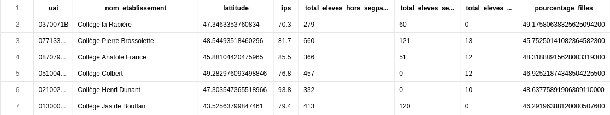
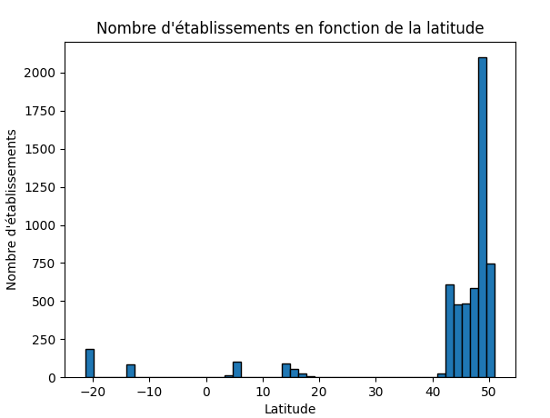
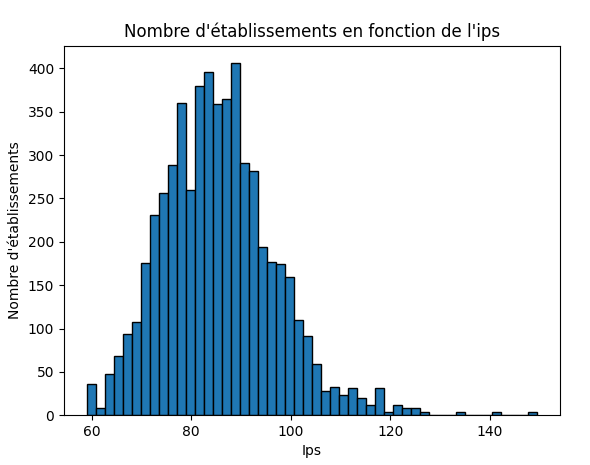
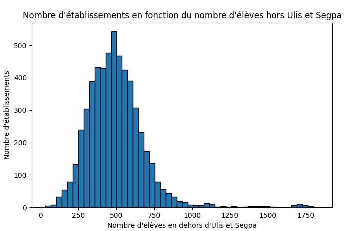
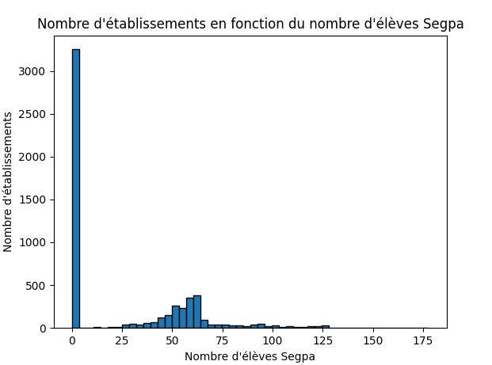
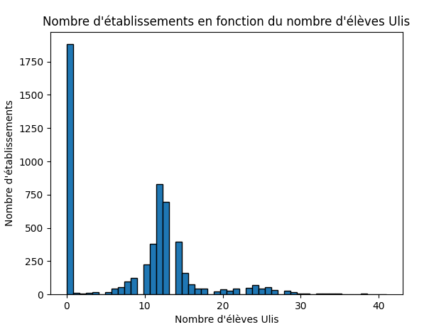
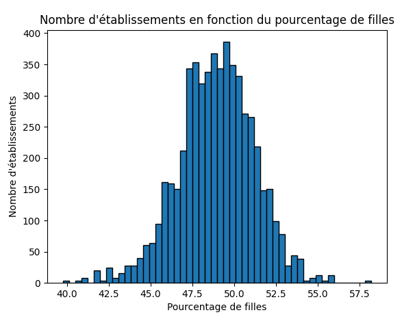
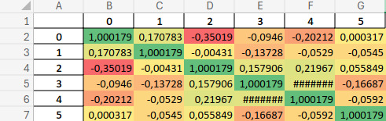

# SAE 2.04 Exploitation d'une base de données

## Livrable 3 | NEVOT Pierre - LE VERGE Lou

### 1 | Les données Colleges.csv - Problématique

#### (a) Le fichier Colleges.csv contient plusieurs séries statistiques sur l’ensemble de tous les collèges répertoriés

**Toutes les données sont issues de l’année 2022-2023.**

La population est l’ensemble des collèges, représentés de manière unique par leur code, et avec l’indication du nom du collège.

La variable andogène est la latitude du collège.

La 1e variable statistique sur cette population est l’indice de position sociale (IPS) moyen du collège.
La 2e est le total d’élèves hors segpa et ulis dans chaque collège.
La 3e est le total d’élèves en segpa dans chaque collège.
La 4e est le total d’élèves en ulis dans chaque collège.
La 5e est le pourcentage de filles dans chaque collège.



#### (b) Problématique :

En utilisant ces données, nous allons tenter de répondre à la problématique suivante :
Est-ce qu'on peut retrouver la latitude d'un collège en fonction des données de notre fichier ?

---

### 2 | Import des données, mise en forme

#### (a) Importer les données en Python

On importe notre vue sous forme de DataFrame avec la commande suivante :

```python
import pandas as pd
import numpy as np
import matplotlib.pyplot as plt

CollegeDF = pd.read_csv("Colleges.csv", delimiter = ";")
```


#### (b) Mise en forme des données

On a besoin de supprimer les cases vides (qui contiennent nan en Python), puis on transforme notre DataFrame en Array :

```python
CollegeDF = CollegeDF.dropna()
CollegeAr = CollegeDF.to_numpy()
```

#### (c) Centrer et réduire les données

On centre les données sur seulement les variables numériques :
On slice notre array pour retirer les 2 premières colonnes qui ne sont pas numériques.

```python
CollegeAr0 = CollegeAr[:,2:]
```

On défini la fonction pour centre et réduire les données :

```python
def Centreduire(Ar):
    n = len(Ar)  # Nombre de lignes dans Ar
    p = len(Ar[0])  # Nombre de colonnes dans Ar
    ResAr = np.zeros((n, p))  # Initialisation de la matrice résultat ResAr avec des zéros
    for j in range(p):  # Parcours de chaque colonne de Ar
        mean = 0  # Initialisation de la moyenne à zéro
        std = 0  # Initialisation de l'écart type à zéro
        # Calcul de la moyenne des éléments de la colonne j
        for i in range(n):
            mean += Ar[i][j]  # Somme des éléments de la colonne j
        mean /= n  # Division par le nombre d'éléments pour obtenir la moyenne
        # Calcul de l'écart type des éléments de la colonne j
        for i in range(n):
            std += (Ar[i][j] - mean) ** 2  # Somme des carrés des écarts par rapport à la moyenne
        std = (std / n) ** 0.5  # Calcul de l'écart type comme la racine carrée de la variance
        # Centrage et réduction des éléments de la colonne j et mise à jour de ResAr
        for i in range(n):
            ResAr[i][j] = (Ar[i][j] - mean) / std  # Formule de centrage et réduction
    return ResAr  # Retourne la matrice ResAr centrée et réduite
```

---


### 3 | Exploration des données

#### (a) Représentations graphiques

On choisit d'étudier avec un diagramme en bâtons nos variables statistiques :

##### Diagramme en bâtons du nombre d'établissement en fonction de la latitude :


Le diagramme en bâtons montre la majorité des établissement sont situé entre le 48.5° et me 49.5°. On peut voir des établissements en -20°, -10°, 5° et entre 15° et 20°. Ce sont des établissements d'outre-mer ou en dehors du territoire métropolitain.

##### Diagramme en bâtons du nombre d'établissement en fonction de l'IPS moyen :


Le diagramme en bâtons montre que la majorité des établissements ont un IPS entre 60 et 100, avec un pic autour de 80. Cela indique une concentration significative dans cette plage d'IPS. Les établissements avec un IPS très élevé ou très bas sont rares, montrant une distribution modérément homogène en termes de statut socio-économique.

##### Diagramme en bâtons du nombre d'établissement en fonction du nombre d'élèves hors segpa et ulis :


Le diagramme en bâtons montre que la majorité des établissements ont entre 250 et 750 élèves hors Ulis et Segpa, avec un pic autour de 500 élèves. Très peu d'établissements ont plus de 1000 élèves dans cette catégorie, indiquant une distribution centrée et une diminution progressive du nombre d'établissements à mesure que le nombre d'élèves augmente.

##### Diagramme en bâtons du nombre d'établissement en fonction du nombre d'élèves en segpa :


Le diagramme en bâtons montre que plus de 3000 établissements n'ont aucun élève en Segpa. Parmi les établissements ayant des élèves Segpa, la majorité en compte moins de 250, avec une concentration notable autour de 500 élèves. Les établissements avec un nombre d'élèves Segpa supérieur à 1000 sont rares, indiquant une distribution asymétrique.

##### Diagramme en bâtons du nombre d'établissement en fonction du nombre d'élèves en ulis :


Le diagramme en bâtons montre que plus de 1750 établissements n'ont aucun élève en Ulis. Parmi les établissements ayant des élèves Ulis, la majorité en compte moins de 10, avec une concentration notable autour de 15 élèves. Les établissements avec un nombre d'élèves Ulis supérieur à 20 sont rares, indiquant une distribution asymétrique.

##### Diagramme en bâtons du nombre d'établissement en fonction du pourcentage de filles :


Le diagramme en bâtons montre que la majorité des établissements ont un pourcentage de filles compris entre 47.5% et 52.5%, avec un pic autour de 50%. Les établissements avec un pourcentage de filles très élevé ou très bas sont rares, montrant une distribution modérément homogène en termes de genre.

#### (b) Matrice de covariance

##### a. Démarche

Dans cette partie, on calcule la matrice de covariance afin de déterminer les relations entre les variables.
On exécute la fonction suivante pour obtenir la matrice de covariance :

```python
MatriceCov = np.cov(CollegeAr0_CR, rowvar = False)
```

##### b. Matrice de covariance

J'ai exporté la matrice de covariance dans un fichier xls, puis j'ai crée une heatmap à l'aide de excel.

```python
MatriceCovDF = pd.DataFrame(MatriceCov) ## On transforme la matrice en DataFrame
MatriceCovDF.to_excel("MatriceCov.xlsx") ## On exporte la matrice en fichier excel
```

On obtient la matrice suivante :



### 4 | Régression linéaire multiple

#### (a) Utilisation de la Régression linéaire multiple

En choissisant la latitude comme variable endogène et les autres variables comme variables explicatives, on peut obtenir une estimation de la latitude d'un collège en fonction des autres informations sur ces collèges.

#### (b) Variables explicatives les plus pertinentes

Notre objectif est de trouver des variables qui expliquent le mieux possible la latitude d'un collège, qui se trouve dans la colonne 0 de CollegesAr0. La colonne 0 de MatriceCov donne les coefficients de corrélation de la latitude avec chacune des autres variables/colonnes de CollegesAr0. On va choisir comme variables explicatives celles qui ont le coefficient de corrélation le plus grand (en valeur absolue) avec la latitude.

Les coefficients de corrélation les plus grands en valeur absolue dans la colonne 0 de MatriceCov sont : 0.350188276, 0.202121957, 0.094597242, 0.170783092, 0.00031658. Ils correspondent aux variables numéros 1, 2, 4, 5 et 3. Les colonnes 1, 2, 4, 5 et 3 de CollegesAr0 correspondent respectivement à :

- IPS (Indice de Position Sociale) de chaque collège
- Nombre d'élèves hors ULIS/SEGPA
- Pourcentage de filles
- Écart-type de l'IPS dans le collège
- Valeur ajoutée du collège

On choisit donc ces variables comme variables explicatives pour notre régression linéaire multiple.

#### (c) Lien avec la problématique

Les paramètres de la régression linéaire multiple nous permettent de déterminer l'importance de chaque variable explicative dans la prédiction de la latitude d'un collège. On peut ainsi déterminer si les variables choisies sont pertinentes pour prédire la latitude d'un collège.

#### (d) Régression linéaire multiple en Python

On fait maintenant une régression linéaire multiple avec Python :

```python
from sklearn.linear_model import LinearRegression

X = CollegeAr0[:,[1,2,4,5,3]]
Y = CollegeAr0[:,0]

reg = LinearRegression().fit(X, Y)
```

On affiche les informations nécessaires :

```python
print("Coefficients de la régression linéaire multiple : \n", reg.coef_)
print("\n Intercept de la régression linéaire multiple : \n", reg.intercept_)
print("\n Score de la régression linéaire multiple : \n", reg.score(X, Y))
```

On obtient les résultats suivants :

```
Coefficients de la régression linéaire multiple : 
 [ 0.23561717 -0.02719114 -0.25702186  0.15035191  0.00314394]

Intercept de la régression linéaire multiple :
 30.58755960452472

Score de la régression linéaire multiple :
 0.16594561393468543
```

#### (e) Paramètres, interprétation

On obtient les paramètres a_0, a_1, a_2, a_3, a_4, a_5 de la régression linéaire multiple comme suit :

- a_0 = 30.58755960452472 (Intercept de la régression linéaire multiple)
- a_1 = 0.23561717 (Coefficient associé à la première variable explicative, par exemple IPS)
- a_2 = -0.02719114 (Coefficient associé à la deuxième variable explicative)
- a_3 = 0.00314394 (Coefficient associé à la troisième variable explicative)
- a_4 = -0.25702186 (Coefficient associé à la quatrième variable explicative)
- a_5 = 0.15035191 (Coefficient associé à la cinquième variable explicative)

Ces coefficients représentent l'effet de chaque variable explicative sur la latitude d'un collège. Par exemple, un coefficient positif signifie que la latitude d'un collège a tendance à augmenter avec la valeur de la variable explicative correspondante, tandis qu'un coefficient négatif signifie que la latitude a tendance à diminuer avec la valeur de la variable explicative.

Le signe de a_0 nous permet de voir que l'intercept de la régression linéaire multiple est positif. Cela signifie que la latitude d'un collège a tendance à être plus élevée que la moyenne lorsque toutes les variables explicatives sont nulles. En d'autres termes, a_0 l'intercept de la régression linéaire multiple est la valeur de la latitude d'un collège lorsque toutes les variables explicatives sont nulles. Qui est 30.58755960452472.

Comme les variables endogène et explicatives sont centrées-réduite, on peut de plus voir que les coefficients de régression linéaire multiple sont comparables entre eux.

#### (f) Coefficient de corrélation multiple, interprétation

Le score de la régression linéaire multiple qui est de 0.16594561393468543 indique que le modèle explique environ 16.6% de la variance de la latitude des collèges basé sur les variables incluses. Cela signifie que les variables IPS, nombre d'élèves hors ULIS/SEGPA, pourcentage de filles, écart-type de l'IPS dans le collège et nombre d'élèves SEGPA, combinées, expliquent partiellement la variation observée dans la latitude des collèges.

### 5 | Conclusion

#### (a) Réponse à la problématique

En utilisant une régression linéaire multiple, nous avons pu évaluer dans quelle mesure les variables telles que l'IPS, le nombre d'élèves hors ULIS/SEGPA, le pourcentage de filles, l'écart-type de l'IPS dans le collège et le nombre d'élèves SEGPA peuvent expliquer la latitude des collèges. Le modèle obtenu explique environ 16.6% de la variance de la latitude des collèges basé sur ces variables.
Cependant, bien que significative, cette proportion de variance expliquée reste relativement faible. Cela suggère que d'autres facteurs non inclus dans notre modèle pourraient également influencer la latitude des collèges.

#### (b) Argumentation à partir des résultats de la régression linéaire

Les coefficients de la régression linéaire multiple nous permettent de quantifier l'impact de chaque variable explicative sur la latitude des collèges :
 - L'IPS (coefficient a_1 = 0.23561717) montre que les collèges avec un indice de position sociale plus élevé tendent à avoir une latitude plus élevée.
 - Le nombre d'élèves hors ULIS/SEGPA (coefficient a_2 = -0.02719114) indique une légère tendance à une latitude plus basse lorsque le nombre d'élèves est plus élevé.
 - Le pourcentage de filles (coefficient a_3 = 0.00314394) montre une très faible augmentation de la latitude avec une augmentation du pourcentage de filles.
Ces résultats suggèrent des associations intéressantes mais nuancées entre ces variables et la localisation géographique des collèges.

#### (c) Interprétations personnelles

Les résultats de la régression linéaire multiple soulignent l'importance de l'IPS dans la prédiction de la latitude des collèges. Cela suggère que les collèges situés dans des zones géographiques spécifiques peuvent avoir des caractéristiques socio-économiques particulières qui influencent leur positionnement géographique.
Pour arriver à un résultat plus abouti, on aurait du avoir plus de variables comme les mentions au brevet, le taux de réussite et autres. Le manque de variables pertinentes et statistiques a pu limiter la qualité de notre régression linéaire multiple.